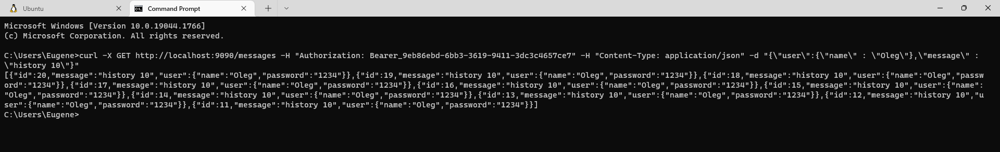
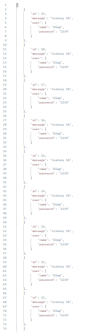

Description
=

Test task for junior java candidate.

Technology/Frameworks/Requirements
=

* Java 11
* Spring Boot 2.7.1 (MVC, DATA)
* H2 Database
* Docker 20.10.17

Sources
-------

Image in docker hub repository - [docker hub](https://hub.docker.com/repository/docker/breinband/dev-task)

Github link to the repository - [github](https://github.com/jeka-jvm/dev-task) or 

cloning repository - 
```
git clone https://github.com/jeka-jvm/dev-task.git
```
STARTUP
-------
### Building image (optionaly)

Use in terminal ```docker build -t dev-task <PATH_TO_ROOT_OF_PROJECT>``` or go to root directory of project and use ```docker build -t dev-task .```

To running assembled image in terminal ```docker run -d -p 9090:8080 --name dev-task dev-task```

### Run docker image from docker hub

Use in terminal ```docker run -d -p 9090:8080 --name dev-task-9090 breinband/dev-task:v1```

Check running image
------

In terminal ```docker image``` and ```docker ps```. Image and container must exist.

Links
-----

> [!NOTE] Database have 2 users with initialized fields -
> ```
> {
>     "name" : "Vasya"/"Oleg"
>     "password" : "123"/"1234"
> }
> ```

1. Checking user credentials and generating token - 
```
curl -X POST http://localhost:9090/token -H 'Content-Type: application/json' -d '{"name":"Oleg","password":"1234"}' 
```
Result


2. Add new message by username - 
```
curl -X POST http://localhost:9090/messages -H "Authorization: Bearer_9eb86ebd-6bb3-3619-9411-3dc3c4657ce7" -H "Content-Type: application/json" -d "{\"user\":{\"name\" : \"Oleg\"},\"message\" : \"history 10\"}" 
```

Result


3. Get 10 last messaged by username -

```
curl -X GET http://localhost:9090/messages -H "Authorization: Bearer_9eb86ebd-6bb3-3619-9411-3dc3c4657ce7" -H "Content-Type: application/json" -d "{\"user\":{\"name\" : \"Oleg\"},\"message\" : \"history 10\"}" 
```

Result


And more presentable view 



